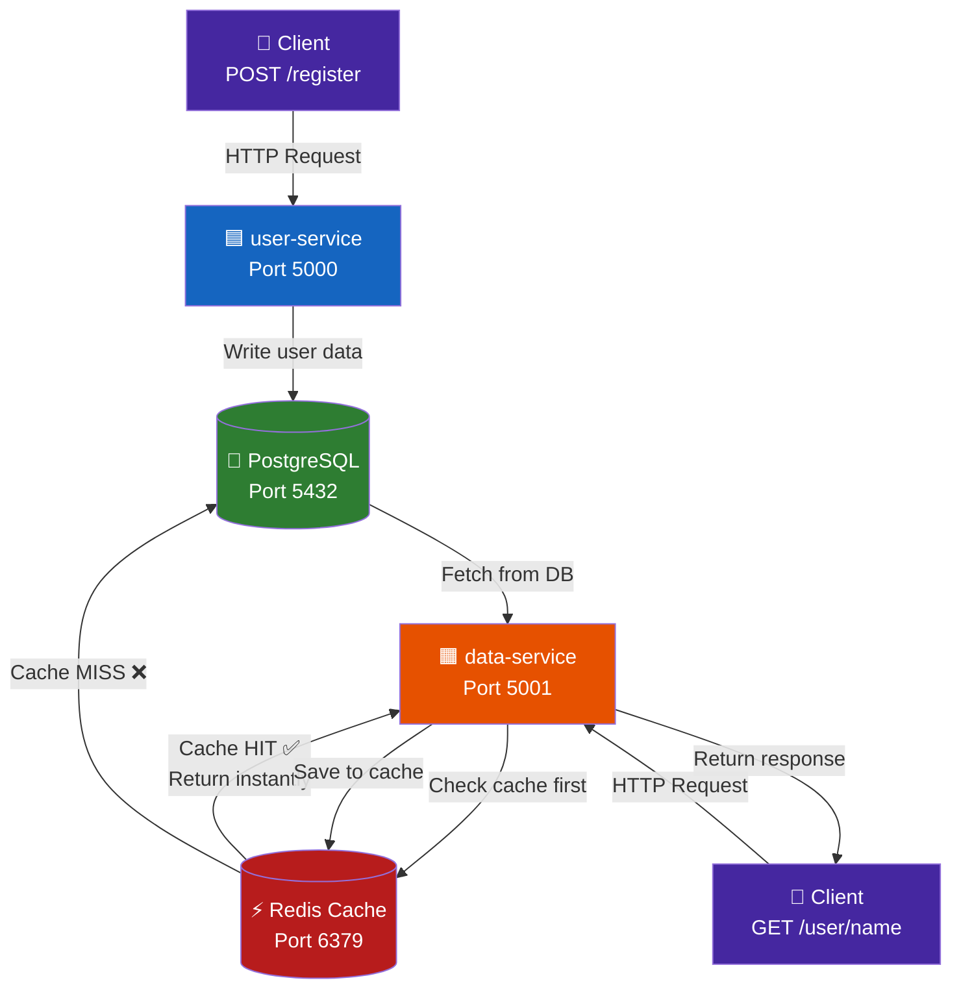

# 🐳 DevOps Microservices Project using Docker

> A Python-based Microservices application with Flask, PostgreSQL, Redis, and Docker  
> **Cloud DevOps Project — SURESHKUMAR S**

---

## 📌 What This Project Does

This project runs **two independent microservices** inside Docker containers:

| Service | What It Does | Port |
|---|---|---|
| **user-service** | Register new users into the database | `5000` |
| **data-service** | Fetch user info (with Redis caching) | `5001` |

Both services share a **PostgreSQL** database and the data-service uses **Redis** as a cache layer to speed up repeated lookups.

Everything is managed with a single `docker-compose.yml` — one command starts all 4 containers.

---

## 🏗️ Architecture



### How Redis Caching Works

```
Request: GET /user/alice
        │
        ▼
  Is "alice" in Redis?
  ├── YES → Return cached data immediately ⚡ (fast!)
  └── NO  → Query PostgreSQL → Save result to Redis → Return data
```

---

## 📁 Project Structure

```
devops_microservices_project/        ← GitHub Repo Root
├── user-service/
│   ├── app.py                        ← Flask app (Register user API)
│   ├── Dockerfile                    ← Docker image for user-service
│   └── requirements.txt              ← Python dependencies (flask, psycopg2)
├── data-service/
│   ├── app.py                        ← Flask app (Fetch user API with cache)
│   ├── Dockerfile                    ← Docker image for data-service
│   └── requirements.txt              ← Python dependencies (flask, redis, psycopg2)
├── docker-compose.yml                ← Runs all 4 services together
└── init.sql                          ← DB schema + seed data (auto-runs on startup)
```

🔗 GitHub Repo: [github.com/skccna1998/devops_microservices_project](https://github.com/skccna1998/devops_microservices_project)

---

## 🛠️ Tech Stack

| Layer | Technology |
|---|---|
| Language | Python 3.9 |
| Web Framework | Flask |
| Database | PostgreSQL 13 |
| Cache | Redis (alpine) |
| Containerization | Docker |
| Orchestration | Docker Compose |
| DB Driver | psycopg2-binary |
| Redis Client | redis-py |

---

## ✅ Prerequisites

Make sure these are installed on your machine:

- [ ] [Docker](https://docs.docker.com/get-docker/)
- [ ] [Docker Compose](https://docs.docker.com/compose/install/)
- [ ] [Git](https://git-scm.com/install/linux)

---

## 🚀 How to Run

### Step 1 — Clone the Repository

```bash
git clone https://github.com/skccna1998/devops_microservices_project.git
cd devops_microservices_project
```

### Step 2 — Start All Services

```bash
docker-compose up --build
```

This one command will:
- Build Docker images for `user-service` and `data-service`
- Pull `postgres:13` and `redis:alpine` images
- Run the `init.sql` to create the database table and add seed users
- Start all 4 containers

### Step 3 — Verify All Containers Are Running

```bash
docker-compose ps
```

You should see 4 containers running:

```
NAME              STATUS
user-service      Up → port 5000
data-service      Up → port 5001
postgres          Up → port 5432
redis             Up → port 6379
```

### Step 4 — Stop All Services

```bash
docker-compose down
```

To also delete the database volume (fresh start):
```bash
docker-compose down -v
```

---

## 🔌 API Endpoints

### 🟦 user-service — `http://localhost:5000`

#### Health Check

```
GET /
```

Response:
```json
{
  "message": "User Service is running"
}
```

---

#### Register a New User

```
POST /register
Content-Type: application/json
```

Request body:
```json
{
  "name": "suresh",
  "info": "Suresh is a CloudOps engineer."
}
```

Success Response (`201`):
```json
{
  "message": "User 'suresh' registered successfully"
}
```

Error Response (`400` — missing fields):
```json
{
  "error": "Name and info are required"
}
```

---

### 🟧 data-service — `http://localhost:5001`

#### Fetch User Info (with Caching)

```
GET /user/<name>
```

Example:
```
GET http://localhost:5001/user/alice
```

Response — First request (fetched from DB):
```json
{
  "name": "alice",
  "cached": false,
  "info": "Alice is a data scientist."
}
```

Response — Second request (served from Redis cache):
```json
{
  "name": "alice",
  "cached": true,
  "info": "Alice is a data scientist."
}
```

Error Response (`404`):
```json
{
  "error": "User 'alice' not found in database"
}
```

---

## 🌱 Pre-Loaded Seed Data

When the project starts, `init.sql` automatically creates the `users` table and loads 3 sample users:

| Name | Info |
|---|---|
| `alice` | Alice is a data scientist. |
| `bob` | Bob is a backend developer. |
| `ram` | Ram is a frontend engineer. |

You can test these right away:
```
GET http://localhost:5001/user/alice
GET http://localhost:5001/user/bob
GET http://localhost:5001/user/ram
```

---

## 🗄️ Database Schema

```sql
CREATE TABLE IF NOT EXISTS users (
    id   SERIAL PRIMARY KEY,
    name TEXT NOT NULL UNIQUE,
    info TEXT NOT NULL
);
```

---

## ⚙️ Environment Variables

All environment variables are set in `docker-compose.yml` — no `.env` file needed.

### user-service

| Variable | Value | Description |
|---|---|---|
| `FLASK_ENV` | `development` | Flask run mode |
| `DB_HOST` | `postgres` | PostgreSQL container name |
| `DB_PORT` | `5432` | PostgreSQL port |
| `DB_NAME` | `users` | Database name |
| `DB_USER` | `postgres` | DB username |
| `DB_PASS` | `postgres` | DB password |

### data-service

| Variable | Value | Description |
|---|---|---|
| `FLASK_ENV` | `development` | Flask run mode |
| `REDIS_HOST` | `redis` | Redis container name |
| `DB_HOST` | `postgres` | PostgreSQL container name |
| `DB_PORT` | `5432` | PostgreSQL port |
| `DB_NAME` | `users` | Database name |
| `DB_USER` | `postgres` | DB username |
| `DB_PASS` | `postgres` | DB password |

---

## 🐞 Troubleshooting

| Problem | Cause | Fix |
|---|---|---|
| `Connection refused` on port 5000/5001 | Containers still starting | Wait 10–15 seconds and retry |
| `data-service` fails to connect to DB | PostgreSQL not ready yet | The service has a retry mechanism — it retries 5 times with 3s delay |
| `port is already allocated` error | Another app is using the port | Stop the other app or change the port in `docker-compose.yml` |
| `init.sql` not running | Volume already exists from previous run | Run `docker-compose down -v` then `docker-compose up --build` |
| Redis not caching | Redis container not running | Check with `docker-compose ps` |

---

## 🏗️ How Docker Compose Links Everything

```
docker-compose up
      │
      ├── Builds user-service image  (from ./user-service/Dockerfile)
      ├── Builds data-service image  (from ./data-service/Dockerfile)
      ├── Pulls postgres:13 image
      ├── Pulls redis:alpine image
      │
      ├── Starts postgres  → runs init.sql automatically
      ├── Starts redis
      ├── Starts user-service  (waits for postgres)
      └── Starts data-service  (waits for redis + postgres)
```

All containers communicate using **Docker's internal network** — services talk to each other using container names (e.g., `postgres`, `redis`) instead of IP addresses.

---

## ✅ What We Built

| Feature | Done |
|---|---|
| user-service with REST API | ✅ |
| data-service with Redis caching | ✅ |
| PostgreSQL with auto schema + seed data | ✅ |
| Docker containers for all services | ✅ |
| Single-command startup with Docker Compose | ✅ |
| DB retry logic in data-service | ✅ |

---

## 👤 Author

**SURESHKUMAR S**  
Cloud DevOps Engineer | DevOps Enthusiast  
🔗 [github.com/skccna1998](https://github.com/skccna1998)
